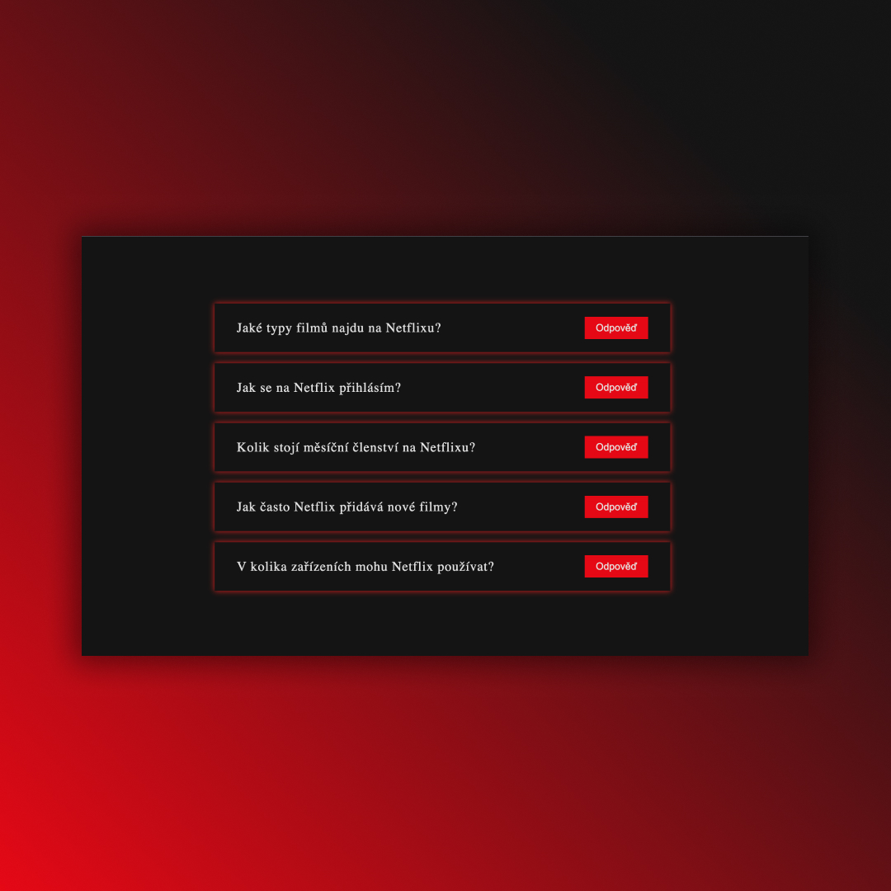

## FAQ Questions
• Practicing useState, props, map, short circuit evalution and spread operator ✅

## Screenshots 📱

## 💻 Tech Stack

## 🌐 Link
<a href="https://faq-questions-dejvcodes.netlify.app/">FAQ Questions</a>

## License🔐
[MIT License](LICENSE)